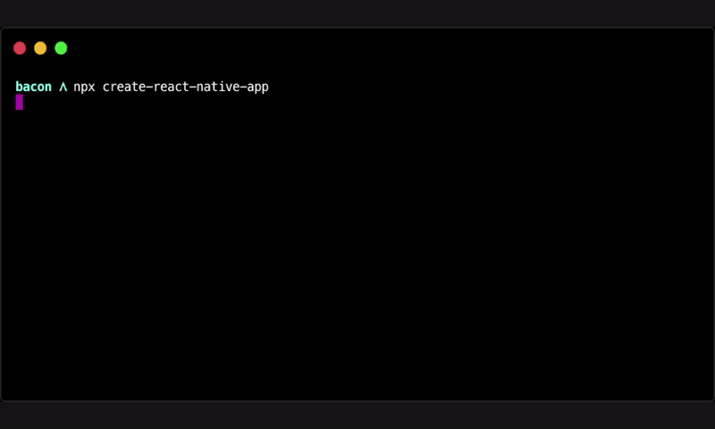

<!-- Title -->

[](https://github.com/expo/create-react-native-app)

<!-- Header -->

<p align="center">
  <b>Create Universal React Native apps with no build configuration.</b>
  <br />

  <p align="center">
    <!-- iOS -->
    
    <!-- Android -->
    
    <!-- Web -->
    
  </p>
  <p align="center">
    <a href="https://packagephobia.now.sh/result?p=create-react-native-app">
      
    </a>
  </p>
  
</p>

<!-- Body -->

```sh
npx create-react-native-app
```

Once you're up and running with Create React Native App, visit [this tutorial](https://reactnative.dev/docs/tutorial) for more information on building mobile apps with React.

<p align="center">
  
</p>

## Features

- Native project ready to be built on to your device.
- Support for unimodules and auto-linking.
- OTA updates, and Gestures out of the box.
- Full support for React Native web.
- Plug-n-play custom templates.
- Works with the Expo Client app.

## Usage

- `npx create-react-native-app` Create a new native React app.
- `yarn ios` -- (`react-native run-ios`) Build the iOS App (requires a MacOS computer).
- `yarn android` -- (`react-native run-android`) Build the Android App.
- `yarn web` -- (`expo start:web`) Run the website in your browser.

### Templates

By default you create a [bare-workflow React](https://docs.expo.io/bare/exploring-bare-workflow/) project with support for iOS, Android, and web. You can opt to use an example project instead by selecting the "Templates from ..." option. Custom templates can be used with `--template <Example Name or GitHub URL>` option.

- Use an [example](https://github.com/expo/examples): `npx create-react-native-app -t with-typescript`
- Use a custom template: `npx create-react-native-app --template https://github.com/someone/my-react-starter` -- Only works with GitHub repos on the master branch.
- All examples can be modified in the [expo/examples](https://github.com/expo/examples) repo.

## Sections

- [Usage with Expo Client App](#usage-with-expo-client-app)
- [Support and Contact](#support-and-contact)
- [FAQs](#faqs)
- [Contributing](#contributing)

## Usage with Expo Client App

Expo Client enables you to work with all of the [Components and APIs](https://facebook.github.io/react-native/docs/getting-started) in `react-native`, as well as the [JavaScript APIs](https://docs.expo.io/versions/latest) that the are bundled with the Expo App.

Expo Client supports running any project that doesn't have custom native modules added.

- Download the "Expo Client" app from the Play Store or App Store.
- Start your project with Expo
  - Install the CLI `npm i -g expo-cli`
  - Start the project `expo start`
- Open the project:
  - Sign in to expo and the project will appear in the app.
  - Or point your phone's camera at the QR code in the terminal (press "c" to view it).

## Support and Contact

If you're having issues with Create React Native App, please make sure:

- The issue is not covered in the [Expo Docs](https://docs.expo.io/versions/latest/)
- There is not already an [open issue](https://github.com/expo/expo-cli/issues) for your particular problem

If you've checked the documentation and currently open issues, please either [open a new GitHub issue](https://github.com/expo/create-react-native-app/issues/new) or ask a question on [Expo forums](https://forums.expo.io/c/help).

## Contributing

Please see [Contributing guide](https://github.com/expo/expo-cli/blob/master/CONTRIBUTING.md) in the Expo CLI monorepo for instructions on contributing to Expo CLI.

### Attribution

The examples feature was inspired by the `templates` system of [create-next-app](https://github.com/zeit/next.js/tree/canary/packages/create-next-app) by the [Vercel](https://vercel.com/) team.

## Related

- [Ignite CLI](https://github.com/infinitered/ignite) by [Infinite Red](https://infinite.red/)
- [Expo CLI](https://github.com/expo/expo-cli) by [Expo team](https://expo.io)
- [React Native Community CLI](https://github.com/react-native-community/cli) by members of [the React Native community](https://github.com/orgs/react-native-community/people)

<!-- Footer -->

## Contributors ✨

<!-- ALL-CONTRIBUTORS-BADGE:START - Do not remove or modify this section -->

[](#contributors-)

<!-- ALL-CONTRIBUTORS-BADGE:END -->

Thanks goes to these wonderful people ([emoji key](https://allcontributors.org/docs/en/emoji-key)):

<!-- ALL-CONTRIBUTORS-LIST:START - Do not remove or modify this section -->
<!-- prettier-ignore-start -->
<!-- markdownlint-disable -->
<table>
  <tr>
    <td align="center"><a href="https://twitter.com/baconbrix"><br /><sub><b>Evan Bacon</b></sub></a><br /><a href="https://github.com/expo/create-react-native-app/commits?author=EvanBacon" title="Code">💻</a></td>
    <td align="center"><a href="https://expo.io"><br /><sub><b>Brent Vatne</b></sub></a><br /><a href="https://github.com/expo/create-react-native-app/commits?author=brentvatne" title="Code">💻</a> <a href="https://github.com/expo/create-react-native-app/commits?author=brentvatne" title="Documentation">📖</a></td>
    <td align="center"><a href="http://hamzah"><br /><sub><b>Hamza Halilovic</b></sub></a><br /><a href="https://github.com/expo/create-react-native-app/commits?author=hamzahalilovic" title="Code">💻</a></td>
    <td align="center"><a href="https://bycedric.com"><br /><sub><b>Cedric van Putten</b></sub></a><br /><a href="https://github.com/expo/create-react-native-app/commits?author=byCedric" title="Code">💻</a></td>
    <td align="center"><a href="https://twitter.com/VilleImmonen"><br /><sub><b>Ville Immonen</b></sub></a><br /><a href="https://github.com/expo/create-react-native-app/commits?author=fson" title="Code">💻</a></td>
    <td align="center"><a href="https://github.com/friederbluemle"><br /><sub><b>Frieder Bluemle</b></sub></a><br /><a href="https://github.com/expo/create-react-native-app/commits?author=friederbluemle" title="Code">💻</a></td>
  </tr>
</table>

<!-- markdownlint-enable -->
<!-- prettier-ignore-end -->

<!-- ALL-CONTRIBUTORS-LIST:END -->

This project follows the [all-contributors](https://github.com/all-contributors/all-contributors) specification. Contributions of any kind welcome!
